# assignment-5-final-project-team-gg
assignment-5-final-project-team-gg created by GitHub Classroom

## TASK 1: free move camera(4%)-Charles
### Key callback
```cpp
  case GLFW_KEY_UP:
      cameraPos -= cameraDirection * 0.25f;
      break;
  case GLFW_KEY_DOWN:
      cameraPos += cameraDirection * 0.25f;
      break;
  case GLFW_KEY_LEFT:
      cameraPos -= glm::normalize(glm::cross(cameraDirection, cameraUp)) * 0.25f;
      break;
  case GLFW_KEY_RIGHT:
      cameraPos += glm::normalize(glm::cross(cameraDirection, cameraUp)) * 0.25f;
      break;
```
### Mouse callback(right click to switch control(key/mouse))
```cpp
    if (button == GLFW_MOUSE_BUTTON_RIGHT && action == GLFW_PRESS) {
        mode = (mode == 0) ? 1 : 0;
    }
```

### Cursor Position
```cpp
static void cursor_position_callback(GLFWwindow* window, double xposIn, double yposIn)
{
    float xpos = static_cast<float>(xposIn);
    float ypos = static_cast<float>(yposIn);
    float xoffset = xpos - lastX;
    float yoffset = lastY - ypos; 
    float sensitivity = 0.5f; 
    glm::vec3 front;

    if (firstMouse){
        lastX = xpos;
        lastY = ypos;
        firstMouse = false;
    }

    lastX = xpos;
    lastY = ypos;

    xoffset *= sensitivity;
    yoffset *= sensitivity;

    yaw += xoffset;
    pitch += yoffset;

    if (pitch > 89.0f)
        pitch = 89.0f;
    if (pitch < -89.0f)
        pitch = -89.0f;
    float xz = cos(glm::radians(pitch));
    front.x = cos(glm::radians(yaw)) * xz;
    front.y = sin(glm::radians(pitch));
    front.z = sin(glm::radians(yaw)) * xz;
    cameraDirection = glm::normalize(front);
}
```

## TASK 2: Objects(12%)-Charles
### Object Class
```cpp
class Object{
public:
	Object(glm::vec3 coords = glm::vec3(0.0, 0.0, 0.0), glm::vec3 col = glm::vec3(1.0, 1.0, 0.0), unsigned int maxI = 0,
		bool reflecting = false, bool refracting = false, bool lighting = false,
		float ambientFactor = 0.2f, float specExponent = 50.0f) {

		this->coords = coords;
		color = col; 
		maxIndex = maxI;
		reflect = reflecting;
		refract = refracting;
		light = lighting;
		ambient = ambientFactor;
		specularEx = specExponent;
	};

	const glm::vec3& Color() { return color; };
	float AmbientFactor() { return ambient; };
	float SpecularExponent() { return specularEx; };
	bool Reflect() { return reflect; };

	void offset(glm::vec3 os) {
		coords += os;
		for (glm::vec3& i : this->vertices) {
			i += os;
		}
	}

	void adjustIndice(unsigned int os) {
		for (glm::ivec3& i : this->indices) {
			i += glm::ivec3(os, os, os);
		}
	}

	glm::vec3 coords;
	std::vector<glm::vec3> vertices;
	std::vector<glm::vec3> normals;
	std::vector<glm::ivec3> indices;
	std::vector<glm::vec2> texCoords;
	unsigned int maxIndex;
	// object color
	glm::vec3 color;
	// basic material parameters
	float ambient;
	float specularEx;
	// is this object reflecting?
	bool reflect;
	bool refract;
	bool light;

private:

};

class Plane : public Object {
public:
	float length;
	float width;
	glm::vec3 normal;
	Plane(glm::vec3 p1, glm::vec3 p2) : Object() {
		glm::vec3 p3 = -p1;
		glm::vec3 p4 = -p2;
		length = glm::distance(p1, p2);
		width = glm::distance(p2, p3);
		normal = glm::normalize(glm::cross(p1, p2));

		vertices.push_back(p1); vertices.push_back(p2); vertices.push_back(p4); vertices.push_back(p3);
		for (int i = 0; i < 4; i++) normals.push_back(normal);
		indices.push_back(glm::vec3(0, 2, 1)); indices.push_back(glm::vec3(1, 2, 3));
		maxIndex = 4;
	}
};


class Torus : public Object {
private:
public:
	float innerRadius;
	float outerRadius;
	unsigned int sector;
	unsigned int stack;
	Torus(float iR, float oR, unsigned int sec, unsigned int sta) : Object() {
		innerRadius = iR;
		outerRadius = oR;
		sector = sec;
		stack = sta;
	}
};


class Sphere : public Object {
private:
public:
	float radius;
	unsigned int sector;
	unsigned int stack;
	Sphere(float r, unsigned int sec, unsigned int sta) : Object() {
		radius = r;
		sector = sec;
		stack = sta;
	}
};

class Cylinder : public Object {
private:
public:
	float radius;
	float height;
	unsigned int sector;
	Cylinder(float r, unsigned int h, unsigned int sec) : Object() {
		radius = r;
		height = h;
		sector = sec;
	}
};

class Capsule : public Object {
private:
public:
	float radius;
	float height;
	unsigned int sector;
	unsigned int stack;
	Capsule(float r, float h, unsigned sec, unsigned sta) : Object() {
		radius = r;
		height = h;
		sector = sec;
		stack = sta;
	}
};

class Cone : public Object {
private:
public:
	float radius;
	float height;
	unsigned int sector;
	Cone(float r, float h, unsigned int sec) : Object() {
		radius = r;
		height = h;
		sector = sec;
	}
};

class TruncatedCone : public Object {
private:
public:
	float topRadius;
	float baseRadius;
	float height;
	unsigned int sector;
	TruncatedCone(float topR, float baseR, float h, unsigned int sec) {
		topRadius = topR;
		baseRadius = baseR;
		height = h;
		sector = sec;
	}
};
```
### Truncated Cone
```cpp
unsigned int truncatedCone(float topRadius, float baseRadius, int sectorCount, float height,
    std::vector<glm::vec3>& vertices, std::vector<glm::vec3>& normals,
    std::vector<glm::ivec3>& indices, std::vector<glm::vec2>& textCoords) {
    //
    float sectorStep = 2.0f * M_PI / float(sectorCount);
    float sectorAngle;
    std::vector<float> unitCircleVertices;
    glm::vec3 cylinderVertexPos;
    glm::vec2 textureCoordinate;
    float coneAngle = atanf((baseRadius - topRadius) / height);
    unsigned int maxElementIndice = 0;

    // init variables
    vertices.resize(0);
    normals.resize(0);
    indices.resize(0);
    textCoords.resize(0);

    // get unit circle vectors on XY-plane
    for (int i = 0; i <= sectorCount; ++i){
        sectorAngle = i * sectorStep;
        unitCircleVertices.push_back(sin(sectorAngle)); // x
        unitCircleVertices.push_back(0); // y
        unitCircleVertices.push_back(cos(sectorAngle));                // z
    }

    // put side vertices to arrays
    for (int i = 0; i < 2; ++i)
    {
        float h = -height / 2.0f + i * height;           // z value; -h/2 to h/2
        float t = 1.0f - i;                              // vertical tex coord; 1 to 0

        for (int j = 0, k = 0; j <= sectorCount; ++j, k += 3)
        {
            sectorAngle = j * sectorStep;

            float ux = unitCircleVertices[k];
            float uy = unitCircleVertices[k + 1];
            float uz = unitCircleVertices[k + 2];
            // position vector
            float sphereRadius = (i == 0) ? baseRadius : topRadius;
            cylinderVertexPos.x = ux * sphereRadius;
            cylinderVertexPos.y = h;
            cylinderVertexPos.z = uz * sphereRadius;
            vertices.push_back(cylinderVertexPos);

            // normal vector
            normals.push_back(glm::normalize(glm::vec3(
                cosf(coneAngle) * sinf(sectorAngle),
                sinf(coneAngle),
                cosf(coneAngle) * cosf(sectorAngle)
            )));

            // calculate texture coordinate
            textureCoordinate.x = (float)j / sectorCount;
            textureCoordinate.y = t;
            textCoords.push_back(textureCoordinate);
        }
    }

    int baseCenterIndex = (int)vertices.size();
    int topCenterIndex = baseCenterIndex + sectorCount + 1; // include center vertex

    // put base and top vertices to arrays
    for (int i = 0; i < 2; ++i)
    {
        float h = -height / 2.0f + i * height;           // z value; -h/2 to h/2
        float ny = -1 + i * 2;                           // z value of normal; -1 to 1

        // center point
        vertices.push_back(glm::vec3(0.0f, h, 0.0f));
        normals.push_back(glm::vec3(0.0f, ny, 0.0f));
        textCoords.push_back(glm::vec2(0.5f, 0.5f));

        for (int j = 0, k = 0; j < sectorCount; ++j, k += 3)
        {
            float ux = unitCircleVertices[k];
            float uz = unitCircleVertices[k + 2];
            // position vector
            float sphereRadius = (i == 0) ? baseRadius : topRadius;
            cylinderVertexPos.x = ux * sphereRadius;
            cylinderVertexPos.y = h;
            cylinderVertexPos.z = uz * sphereRadius;
            vertices.push_back(cylinderVertexPos);

            // normal vector
            normals.push_back(glm::vec3(0.0f, ny, 0.0f));

            // texture coordinate
            textureCoordinate.x = -ux * 0.5f + 0.5f;
            textureCoordinate.y = -uz * 0.5f + 0.5f;
            textCoords.push_back(textureCoordinate);

        }
    }

    unsigned int k1 = 0;                         // 1st vertex index at base
    unsigned int k2 = sectorCount + 1;           // 1st vertex index at top

    // indices for the side surface
    for (int i = 0; i < sectorCount; ++i, ++k1, ++k2)
    {
        // 2 triangles per sector
        // k1 => k1+1 => k2
        indices.push_back(glm::ivec3(k1, k2, k1 + 1));

        // k2 => k1+1 => k2+1
        indices.push_back(glm::ivec3(k1 + 1, k2, k2 + 1));
        maxElementIndice = std::max(maxElementIndice, std::max(k1, k2));
    }

    for (unsigned int i = 0, k = baseCenterIndex + 1; i < sectorCount; ++i, ++k)
    {
        if (i < sectorCount - 1)
        {
            indices.push_back(glm::ivec3(baseCenterIndex, k + 1, k));
        }
        else // last triangle
        {
            indices.push_back(glm::ivec3(baseCenterIndex, baseCenterIndex + 1, k));
        }
        maxElementIndice = std::max(maxElementIndice, k);
    }

    // indices for the top surface
    if (topRadius != 0) {
        for (unsigned int i = 0, k = topCenterIndex + 1; i < sectorCount; ++i, ++k)
        {
            if (i < sectorCount - 1)
            {
                indices.push_back(glm::ivec3(topCenterIndex, k, k + 1));
            }
            else // last triangle
            {
                indices.push_back(glm::ivec3(topCenterIndex, k, topCenterIndex + 1));
            }
            maxElementIndice = std::max(maxElementIndice, k);
        }
    }
    return maxElementIndice + 1;
}

```

### Cone
```cpp
unsigned int cone(float radius, int sectorCount, float height,
    std::vector<glm::vec3>& vertices, std::vector<glm::vec3>& normals,
    std::vector<glm::ivec3>& indices, std::vector<glm::vec2>& textCoords) {
    return truncatedCone(0.0f, radius, sectorCount, height, vertices, normals, indices, textCoords);
}
```

### Cylinder
```cpp
unsigned int cylinder(float radius, int sectorCount, float height,
    std::vector<glm::vec3>& vertices, std::vector<glm::vec3>& normals,
    std::vector<glm::ivec3>& indices, std::vector<glm::vec2>& textCoords) {
    return truncatedCone(radius, radius, sectorCount, height, vertices, normals, indices, textCoords);
}
```

### Capsule
```cpp
unsigned int capsule(float topRadius, float baseRadius, int sectorCount, int stackCount, float height,
    std::vector<glm::vec3>& vertices, std::vector<glm::vec3>& normals,
    std::vector<glm::ivec3>& indices, std::vector<glm::vec2>& textCoords) {
    //
    float xy;
    float sectorStep = 2.0f * M_PI / float(sectorCount);
    float stackStep = M_PI / float(stackCount);
    float sectorAngle, stackAngle;
    std::vector<float> unitCircleVertices;
    glm::vec3 capsuleVertexPos;
    glm::vec2 textureCoordinate;

    float cylinderHeight = height - topRadius - baseRadius;
    glm::vec3 topCenter(0.0f, cylinderHeight / 2.0f, 0.0f);
    glm::vec3 baseCenter(0.0f, -cylinderHeight / 2.0f, 0.0f);

    float coneAngle = atanf((baseRadius - topRadius) / cylinderHeight);

    // init variables
    vertices.resize(0);
    normals.resize(0);
    indices.resize(0);
    textCoords.resize(0);

    // get unit circle vectors on XZ-plane
    for (int i = 0; i <= sectorCount; ++i) {
        sectorAngle = i * sectorStep;
        unitCircleVertices.push_back(sinf(sectorAngle));                 // x
        unitCircleVertices.push_back(0);                                // y
        unitCircleVertices.push_back(cosf(sectorAngle));                 // z
    }


    // vertex, normal, texture coordinate
    for (int x = 0; x < 3; ++x) {
        switch (x) {
        case 0:     // top semisphere
            for (int i = 0; i <= (stackCount / 2); ++i) {
                stackAngle = M_PI / 2.0f - i * stackStep;
                xy = topRadius * cosf(stackAngle);
                capsuleVertexPos.y = topRadius * sinf(stackAngle) + (cylinderHeight / 2);
                for (int j = 0; j <= sectorCount; ++j) {
                    sectorAngle = j * sectorStep;

                    // vertex position
                    capsuleVertexPos.x = xy * sinf(sectorAngle);
                    capsuleVertexPos.z = xy * cosf(sectorAngle);
                    vertices.push_back(capsuleVertexPos);

                    // normalized vertex normal
                    normals.push_back(glm::normalize(capsuleVertexPos - topCenter));

                    // calculate texture coordinate
                    textureCoordinate.x = float(j) / sectorCount;
                    textureCoordinate.y = float(i) * (topRadius / height) / (stackCount/2);
                    textCoords.push_back(textureCoordinate);
                }
            }
            break;
        case 1:     // cylinder
            for (int i = 1; i >= 0; --i) {
                float h = -cylinderHeight / 2.0f + i * cylinderHeight;           // z value; h/2 to -h/2
                float t = 1.0f - i;                              // vertical tex coord; 1 to 0
                for (int j = 0, k = 0; j <= sectorCount; ++j, k += 3) {
                    sectorAngle = j * sectorStep;

                    float ux = unitCircleVertices[k];
                    float uy = unitCircleVertices[k + 1];
                    float uz = unitCircleVertices[k + 2];
                    // position vector
                    float capsuleRadius = (i == 0) ? baseRadius : topRadius;
                    capsuleVertexPos.x = ux * capsuleRadius;
                    capsuleVertexPos.y = h;
                    capsuleVertexPos.z = uz * capsuleRadius;
                    vertices.push_back(capsuleVertexPos);

                    // normal vector
                    normals.push_back(glm::normalize(glm::vec3(
                        cosf(coneAngle) * sinf(sectorAngle),
                        sinf(coneAngle),
                        cosf(coneAngle) * cosf(sectorAngle)
                    )));

                    // calculate texture coordinate
                    textureCoordinate.x = (float)j / sectorCount;
                    textureCoordinate.y = (i == 1) ? (topRadius / height) : ((height - baseRadius) / height);
                    textCoords.push_back(textureCoordinate);
                }
            }
            break;
        case 2:     // bottom semisphere
            for (int i = (stackCount / 2); i <= stackCount; ++i) {
                stackAngle = M_PI / 2.0f - i * stackStep;
                xy = baseRadius * cosf(stackAngle);
                capsuleVertexPos.y = (baseRadius * sinf(stackAngle)) - (cylinderHeight / 2);
                for (int j = 0; j <= sectorCount; ++j) {
                    sectorAngle = j * sectorStep;

                    // vertex position
                    capsuleVertexPos.x = xy * sinf(sectorAngle);
                    capsuleVertexPos.z = xy * cosf(sectorAngle);
                    vertices.push_back(capsuleVertexPos);

                    // normalized vertex normal
                    normals.push_back(glm::normalize(capsuleVertexPos - baseCenter));

                    // calculate texture coordinate
                    textureCoordinate.x = float(j) / sectorCount;
                    textureCoordinate.y = (float(i - (stackCount / 2)) * (baseRadius / height) / (stackCount / 2)) + ((height - baseRadius) / height);
                    textCoords.push_back(textureCoordinate);
                }
            }
            break;
        }
    }

    // indices
        // compute triangle indices
    unsigned int k1, k2;
    unsigned int maxElementIndice;
    for (int i = 0; i < (stackCount + 3); ++i) {
        k1 = i * (sectorCount + 1);
        k2 = k1 + sectorCount + 1;

        for (int j = 0; j < sectorCount; ++j, ++k1, ++k2) {
            // 2 triangles per sector excluding first and last stacks
            // k1 => k2 => k1+1
            if (i != 0) {
                indices.push_back(glm::ivec3(k1, k2, k1 + 1));
            }
            // k1+1 => k2 => k2+1
            if (i != (stackCount + 2)) {
                indices.push_back(glm::ivec3(k1 + 1, k2, k2 + 1));
            }
            maxElementIndice = std::max(maxElementIndice, std::max(k1, k2));
        }
    }
    return maxElementIndice + 1;
}
```

### Torus
```cpp
unsigned int torus(float outerRadius, float innerRadius, int sectorCount, int stackCount,
    std::vector<glm::vec3>& vertices, std::vector<glm::vec3>& normals,
    std::vector<glm::ivec3>& indices, std::vector<glm::vec2>& textCoords) {
    // init variables
    vertices.resize(0);
    normals.resize(0);
    indices.resize(0);
    textCoords.resize(0);
    // temp variables
    glm::vec3 torusVertexPos;
    glm::vec2 textureCoordinate;

    float sectorStep = 2.0f * M_PI / float(sectorCount);
    float stackStep = 2.0f * M_PI / float(stackCount);
    float sectorAngle, stackAngle;

    // compute vertices and normals
    for (int i = 0; i <= stackCount; ++i) {
        stackAngle = M_PI / 2.0f - i * stackStep;
        torusVertexPos.y = innerRadius * sinf(stackAngle);

        for (int j = 0; j <= sectorCount; ++j) {
            sectorAngle = j * sectorStep;

            // vertex position
            torusVertexPos.x = sinf(sectorAngle) * (innerRadius * cosf(stackAngle) + outerRadius);
            torusVertexPos.z = cosf(sectorAngle) * (innerRadius * cosf(stackAngle) + outerRadius);
            vertices.push_back(torusVertexPos);

            // normalized vertex normal
            normals.push_back(glm::normalize(torusVertexPos - glm::vec3(outerRadius * sinf(sectorAngle), 0.0f, outerRadius * cosf(sectorAngle))));

            // calculate texture coordinate
            textureCoordinate.x = float(j) / sectorCount;
            textureCoordinate.y = float(i) / stackCount;
            textCoords.push_back(textureCoordinate);
        }
    }

    // compute triangle indices
    unsigned int k1, k2;
    unsigned int maxElementIndice = 0;
    for (int i = 0; i < stackCount; ++i) {
        k1 = i * (sectorCount + 1);
        k2 = k1 + sectorCount + 1;

        for (int j = 0; j < sectorCount; ++j, ++k1, ++k2) {
            // 2 triangles per sector excluding first and last stacks
            // k1 => k2 => k1+1

            indices.push_back(glm::ivec3(k1, k2, k1 + 1));

            // k1+1 => k2 => k2+1

            indices.push_back(glm::ivec3(k1 + 1, k2, k2 + 1));

            maxElementIndice = std::max(maxElementIndice, std::max(k1, k2));

        }
    }
    return maxElementIndice + 1;

}
```

### RESULT


## TASK 3: Lights(16%)-Charles
### Light Class
```cpp
class Light {
public:
    Light(int identifier = 0, float Ia = 0.2f, float Ii = 1.0f, glm::vec3 direction = glm::vec3(0.0, 0.0, 0.0)) {
        this->identifier = identifier;
        I_a = Ia;
        I_i = Ii;
        this->direction = direction;
    }

    float I_a;
    float I_i;

    // 0: directionection, 1: Point, 2: Spot, 3: area
    float identifier;
    std::vector<glm::vec3> vertices;
    glm::vec3 direction;
};

// 1: identifier 4: vertex 1: directionection 1:Ia 1:Ii

class directionectionalLight : public Light {
public:
    directionectionalLight(glm::vec3 d) : Light() {
        identifier = 0;
        for (int i = 0; i < 4; i++) vertices.push_back(glm::vec3(0, 0, 0));
        direction = d;
    }
};


class PointLight : public Light {
public:
    glm::vec3 position;
    PointLight(glm::vec3 p) : Light() {
        identifier = 1;

        position = p;
        vertices.push_back(position);
        for (int i = 0; i < 3; i++) vertices.push_back(glm::vec3(0, 0, 0));

    }
};


class SpotLight : public Light {
public:
    SpotLight(glm::vec3 p, glm::vec3 d, float a) : Light() {
        identifier = 2;

        vertices.push_back(p);
        vertices.push_back(glm::vec3(a, 0.0, 0.0));
        for (int i = 0; i < 2; i++) vertices.push_back(glm::vec3(0, 0, 0));

        direction = d;

    }
};


class Arealight : public Light {
public:
    Arealight(glm::vec3 v1, glm::vec3 v2, glm::vec3 center) : Light() {
        identifier = 3;

        glm::vec3 v3, v4;
        v3 = center + (center - v1);
        v4 = center + (center - v2);
        vertices.push_back(v1);
        vertices.push_back(v2);
        vertices.push_back(v3);
        vertices.push_back(v4);

        direction = glm::normalize( glm::cross((v1 - center), (v2 - center)) );

    }

};
```
### pass data to tbo
```cpp
void TBOlight_prepare(std::vector<float>& tbo, int id, 
    std::vector<glm::vec3>& vertex,
    glm::vec3 direction,
    float Ia, float Ii) {

    //std::cout << Ia << Ii << std::endl;
    tbo.push_back((float)id);
    tbo.push_back(Ia);
    tbo.push_back(Ii);
    for (int i = 0; i < 4; ++i) {
        // positions
        tbo.push_back(vertex[i].x);
        tbo.push_back(vertex[i].y);
        tbo.push_back(vertex[i].z);
    }

    tbo.push_back(direction.x);
    tbo.push_back(direction.y);
    tbo.push_back(direction.z);
}
```

### get data in fragement shader
```cpp
struct Light{
    float id;
    float Ia;
    float Ii;
    vec3 p1;
    vec3 p2;
    vec3 p3;
    vec3 p4;
    vec3 dir;
};

Light get_light(int i){
// [id Ia Ii] [p1] [p2] [p3] [p4] [dir]
    Light light;
    light.id = texelFetch(tria2, 6 * i).r;
    light.Ia = texelFetch(tria2, 6 * i).g;
    light.Ii = texelFetch(tria2, 6 * i).b;
    light.p1 = texelFetch(tria2, 6 * i + 1).rgb;
    light.p2 = texelFetch(tria2, 6 * i + 2).rgb;
    light.p3 = texelFetch(tria2, 6 * i + 3).rgb;
    light.p4 = texelFetch(tria2, 6 * i + 4).rgb;
    light.dir = texelFetch(tria2, 6 * i + 5).rgb;
    return light;
}
```
### Directional light

### Point light

### Spot light

### Area light

### Multiple light(phong & shader)
```cpp
    currentColor = inter_buffer[current_depth].color;
    for(int k = current_depth; k >=0; --k){
        if(inter_buffer[k].is_reflecting){
            result -= vec3(0.03,0.03,0.03);
            continue;
        }
        for(int i = 0; i < tbo_size2; i++){
            Light l = get_light(i);
            vec3 temp;
            temp = shadow2(inter_buffer[k], l);
            if(  temp != vec3(-1.0) ){
                currentColor = temp;
            }else{
                currentColor = Phong3(inter_buffer[k].color, inter_buffer[k].normal, inter_buffer[k].position, camPos, l);
            }
            result += currentColor;
        }
    }
    return clamp(result, 0.0, 1.0);
```
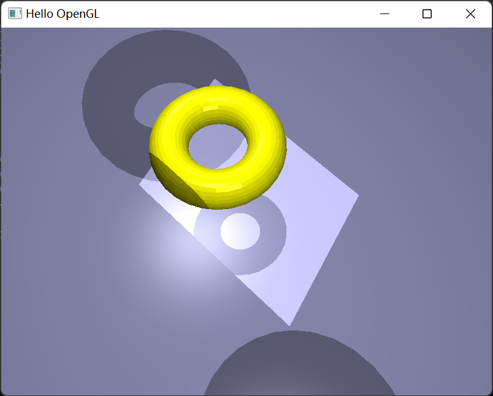

## TASK 4: Ray Tracing(16%)-Nick
### send vertices, normals, indices to tbo in form of triangle
```cpp
void TBO_prepare(std::vector<float>& tbo, std::vector<glm::vec3>& vertex, std::vector<glm::vec3>& normal, 
                    std::vector<glm::ivec3>& tria, glm::vec3 col, bool is_reflecing, bool is_light){
    std::cout<<tria.size()<<std::endl;
    for(int i = 0; i < tria.size(); ++i){
        // positions
        tbo.push_back(vertex[tria[i].x].x);
        tbo.push_back(vertex[tria[i].x].y);
        tbo.push_back(vertex[tria[i].x].z);
        tbo.push_back(vertex[tria[i].y].x);
        tbo.push_back(vertex[tria[i].y].y);
        tbo.push_back(vertex[tria[i].y].z);
        tbo.push_back(vertex[tria[i].z].x);
        tbo.push_back(vertex[tria[i].z].y);
        tbo.push_back(vertex[tria[i].z].z);
        // normal
        tbo.push_back(normal[tria[i].x].x);
        tbo.push_back(normal[tria[i].x].y);
        tbo.push_back(normal[tria[i].x].z);
        tbo.push_back(normal[tria[i].y].x);
        tbo.push_back(normal[tria[i].y].y);
        tbo.push_back(normal[tria[i].y].z);
        tbo.push_back(normal[tria[i].z].x);
        tbo.push_back(normal[tria[i].z].y);
        tbo.push_back(normal[tria[i].z].z);
        // color
        tbo.push_back(col.x);
        tbo.push_back(col.y);
        tbo.push_back(col.z);
        // is_reflecing
        if(is_reflecing) tbo.push_back(5);
        else tbo.push_back(0);
        // is_light
        if(is_light) tbo.push_back(5);
        else tbo.push_back(0);
        tbo.push_back(0);
    }
}
```
### read data in fragment shader
```cpp
struct Triangle{
    vec3 v1;
    vec3 v2;
    vec3 v3; // vectices of the triangle
    vec3 n1;
    vec3 n2;
    vec3 n3; // normals of the triangle
    vec3 color;
    bool is_reflecting;
    bool is_light;
    int id;
};

Triangle get_triangle(int i){
    Triangle triangle;
    triangle.v1 = texelFetch(tria, 8 * i).rgb;
    triangle.v2 = texelFetch(tria, 8 * i + 1).rgb;
    triangle.v3 = texelFetch(tria, 8 * i + 2).rgb;
    triangle.n1 = texelFetch(tria, 8 * i + 3).rgb;
    triangle.n2 = texelFetch(tria, 8 * i + 4).rgb;
    triangle.n3 = texelFetch(tria, 8 * i + 5).rgb;
    triangle.color = texelFetch(tria, 8 * i + 6).rgb;
    //triangle.color = vec3(texture(tex, TexCoords));
    vec3 temp = texelFetch(tria,8 * i + 7).rgb;
    triangle.is_reflecting = temp.r >= 1;
    triangle.is_light = temp.g >= 1;
    triangle.id = i;
    return triangle;
}
```
### Ray & Intersection
```cpp
struct Ray{
    vec3 ray_origin;
    vec3 ray_dir;
};

struct Intersection{
    vec3 position;
    vec3 normal;
    vec3 color;
    float d; // distance
    bool is_intersecting;
    bool is_reflecting;
    bool is_light;
    int triangle_id;
};

// ray triangle intersection
Intersection intersect(Ray ray, Triangle triangle){
    Intersection inter;
    // initialize a non-intersection
    inter.is_intersecting = false;
    inter.is_reflecting = false;
    inter.is_light = false;
    inter.color = vec3(0);
    inter.d = -1;
    inter.triangle_id = -1;
    vec3 n = normalize(cross(triangle.v1 - triangle.v2, triangle.v2 - triangle.v3));
    float perpen = dot(ray.ray_dir, n);
    if(perpen == 0) 
        return inter;
    float t = dot((triangle.v1 - ray.ray_origin), n) / perpen;

    if(t < 0)
        return inter;

    vec3 intersection_point = ray.ray_origin + ray.ray_dir * t;
    vec3 v0 = triangle.v3 - triangle.v1;
    vec3 v1 = triangle.v2 - triangle.v1;
    vec3 v2 = intersection_point - triangle.v1;

    float dot_00 = dot(v0, v0);
    float dot_01 = dot(v0, v1);
    float dot_02 = dot(v0, v2);
    float dot_11 = dot(v1, v1);
    float dot_12 = dot(v1, v2);

    float inverse_denom = 1.0 / (dot_00 * dot_11 - dot_01 * dot_01);
    float u = (dot_11 * dot_02 - dot_01 * dot_12) * inverse_denom;
    float v = (dot_00 * dot_12 - dot_01 * dot_02) * inverse_denom;

    if ((u >= 0) && (v >= 0) && (u + v < 1)){
        if(perpen>0)   
            inter.normal = -n;
        else
            inter.normal = n;
        inter.position = intersection_point;
        inter.color = triangle.color;
        inter.is_intersecting = true;
        inter.is_reflecting = triangle.is_reflecting;
        inter.is_light = triangle.is_light;
        inter.d = t;
        inter.triangle_id = triangle.id;
        return inter; 
    } 
    else 
        return inter;
}
```

### Ray tracer
use stack iteration to replace recursion
```cpp
vec3 ray_tracing(){
    int depth = 10;
    vec3 currentColor, result = vec3(0.0);
    vec3 pos_temp = camPos;
    vec3 dir_temp = normalize(pos - camPos);
    Intersection inter_buffer[10];
    int current_depth = 0;
    int current_id = -1;
    for(int i = 0; i < depth; ++i){
        Ray ray = Ray(pos_temp, dir_temp);
        float min_distance = -1;
        Intersection inter;
        for(int j = 0; j < tbo_size; ++j){
            // generate the triangle
            Triangle triangle = get_triangle(j);
            Intersection temp_inter = intersect(ray, triangle);
            if(temp_inter.is_intersecting && (temp_inter.d < min_distance || min_distance < 0)
                && current_id != temp_inter.triangle_id){
                min_distance = temp_inter.d;
                inter = temp_inter;
            }
        }
        if(!inter.is_intersecting){
            inter.color = vec3(1,0,0);
            break;
        }
        inter_buffer[i] = inter;
        current_id = inter.triangle_id;
        if(!inter.is_reflecting){
            break;
        }
        else{
            current_depth++;
            pos_temp = inter.position;
            dir_temp = normalize(reflect(dir_temp, inter.normal));
        }
    }
    currentColor = inter_buffer[current_depth].color;
    for(int k = current_depth; k >=0; --k){
        if(inter_buffer[k].is_reflecting){
            result -= vec3(0.03,0.03,0.03);
            continue;
        }
        for(int i = 0; i < tbo_size2; i++){
            Light l = get_light(i);
            vec3 temp;
            temp = shadow2(inter_buffer[k], l);
            if(  temp != vec3(-1.0) ){
                currentColor = temp;
            }else{
                currentColor = Phong3(inter_buffer[k].color, inter_buffer[k].normal, inter_buffer[k].position, camPos, l);
            }
            result += currentColor;
        }
    }
    return clamp(result, 0.0, 1.0);
}
```

### Reflection
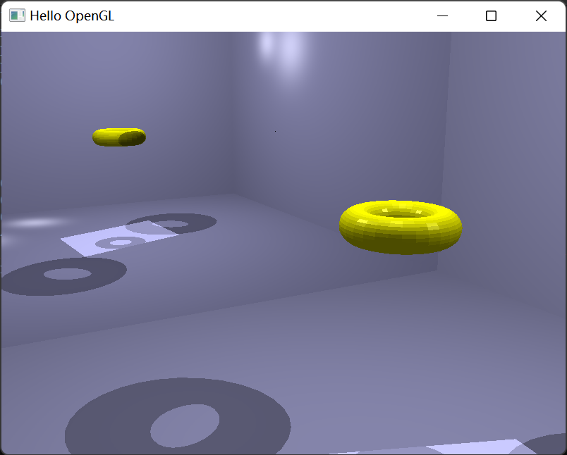
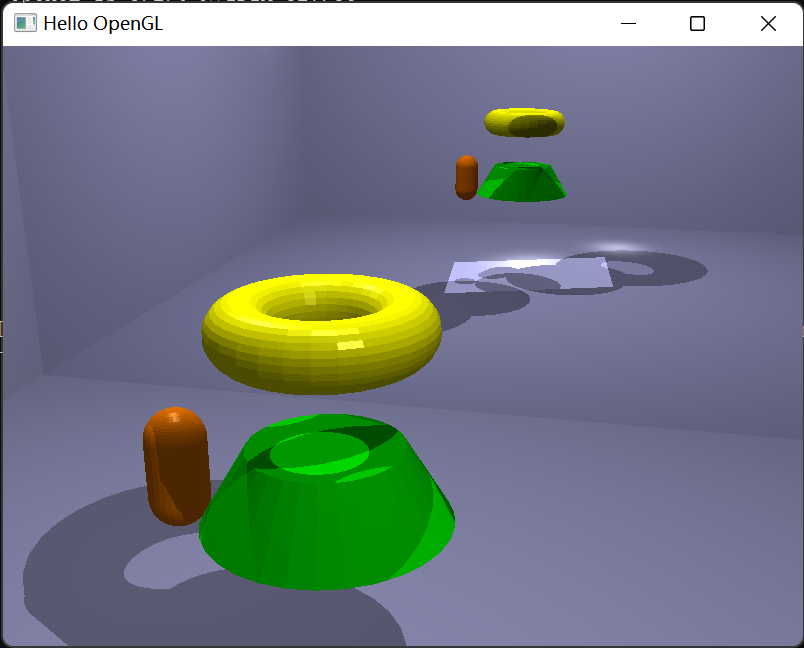
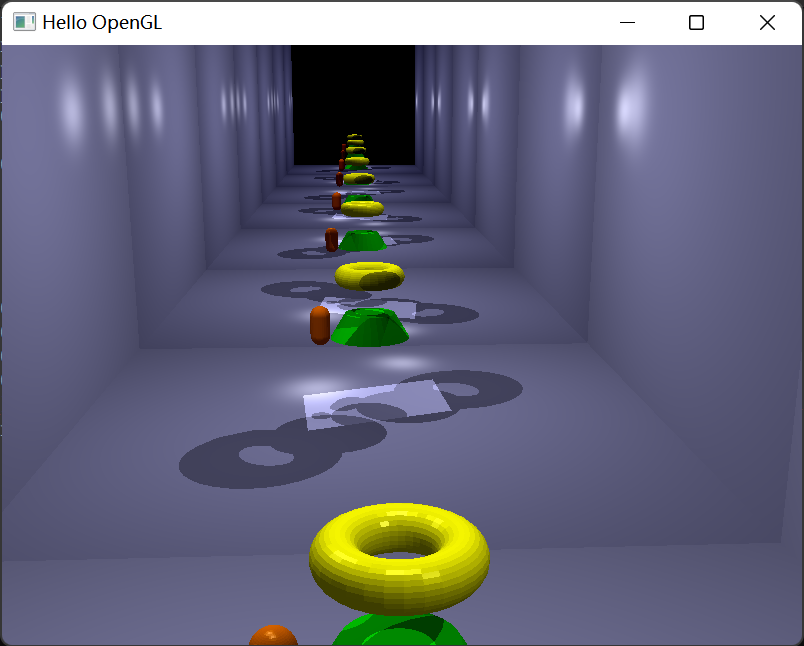


## TASK 5: Spatial Data Structure(20%)-Nick

Ray tracing acceleration with Bounding volume hierarchy

Triangle struct
```cpp
struct Triangle{
    glm::vec3 v1;
    glm::vec3 v2;
    glm::vec3 v3;
    //int index;
    bool is_reflecting;
    glm::vec3 color;

    Triangle(glm::vec3 vertex1, glm::vec3 vertex2, glm::vec3 vertex3, glm::vec3 c = glm::vec3(0.0f,0.0f,0.0f), bool reflecting = false){
        v1= vertex1; v2 = vertex2; v3 = vertex3;
        color = c;
        is_reflecting = reflecting;
    }

    Triangle(){}

    glm::vec3 min_vertex(){
        return glm::vec3(min(v1.x, v2.x, v3.x), min(v1.y, v2.y, v3.y), min(v1.z, v2.z, v3.z));
    }

    glm::vec3 max_vertex(){
        return glm::vec3(max(v1.x, v2.x, v3.x), max(v1.y, v2.y, v3.y), max(v1.z, v2.z, v3.z));
    }

    glm::vec3 minn(glm::vec3 v){
        return glm::vec3(min(min_vertex().x, v.x), min(min_vertex().y, v.y), min(min_vertex().z, v.z));
    }

    glm::vec3 maxx(glm::vec3 v){
        return glm::vec3(max(max_vertex().x, v.x), max(max_vertex().y, v.y), max(max_vertex().z, v.z));
    }

};
```

BVH implementation

```cpp
class bvh{
public:
    glm::vec3 minv;
    glm::vec3 maxv;
    bool is_leaf;
    bvh* left;
    bvh* right;
    Triangle t;

    bvh(glm::vec3 min_v, glm::vec3 max_v, bool is_root = false, Triangle triangle = Triangle()){
        minv = min_v;
        maxv = max_v;
        is_leaf = is_root;
        t = triangle;
        left = NULL;
        right = NULL;
    }

    int get_left(int root){ return root * 2 + 3;}
    int get_right(int root){ return root * 2 + 3 + 3;}

};

bool compare_X(Triangle t1, Triangle t2){
    return (t1.v1.x + t1.v2.x + t1.v3.x) > (t2.v1.x + t2.v2.x + t2.v3.x);
}

bool compare_Y(Triangle t1, Triangle t2){
    return (t1.v1.y + t1.v2.y + t1.v3.y) > (t2.v1.y + t2.v2.y + t2.v3.y);
}

bool compare_Z(Triangle t1, Triangle t2){
    return (t1.v1.z + t1.v2.z + t1.v3.z) > (t2.v1.z + t2.v2.z + t2.v3.z);
}

void write_vec3(float* offset, glm::vec3 v){
    *offset = v.x;
    *(offset + 1) = v.y;
    *(offset + 2) = v.z;
}

// axis: x->0, y->1, z->2
bvh* create_bvh(std::vector<Triangle>& tria, int begin, int end, int axis){
    if(begin + 1 == end){
        return new bvh(tria[begin].min_vertex(), tria[begin].max_vertex(), true, tria[begin]);
    }
    switch(axis){
        case 0: // x-axis
            sort(tria.begin() + begin, tria.begin() + end, compare_X);
            break;
        case 1: // y-axis
            sort(tria.begin() + begin, tria.begin() + end, compare_Y);
            break;
        case 2: // z-axis
            sort(tria.begin() + begin, tria.begin() + end, compare_Z);
            break;
    }
    glm::vec3 minV = tria[begin].min_vertex(), maxV = tria[begin].max_vertex();
    for(int i = begin; i < end; ++i){
        minV = tria[i].minn(minV);
        maxV = tria[i].maxx(maxV);
    }
    bvh* _bvh = new bvh(minV, maxV);
    switch(axis){
        case 0: // x-axis
            _bvh->left = create_bvh(tria, begin, begin + (end - begin) / 2, 1);
            _bvh->right = create_bvh(tria, begin + (end - begin) / 2, end, 1);
            break;
        case 1: // y-axis
            _bvh->left = create_bvh(tria, begin, begin + (end - begin) / 2, 2);
            _bvh->right = create_bvh(tria, begin + (end - begin) / 2, end, 2);
            break;
        case 2: // z-axis
            _bvh->left = create_bvh(tria, begin, begin + (end - begin) / 2, 0);
            _bvh->right = create_bvh(tria, begin + (end - begin) / 2, end, 0);
            break;
    }
    return _bvh;
}

void write_bvh_tbo(float* _bvh, float* tria, bvh* root, int i, int &idx){
    if(root == nullptr) return;
    // _write the bvh
    _bvh[i * 3] = root->minv.x;
    _bvh[i * 3 + 1] = root->minv.x;
    _bvh[i * 3 + 2] = root->minv.x;
    _bvh[(i + 1) * 3] = root->maxv.x;
    _bvh[(i + 1) * 3 + 1] = root->maxv.x;
    _bvh[(i + 1) * 3 + 2] = root->maxv.x;
    _bvh[(i + 2) * 3] = root->is_leaf ? (float) idx : -1;
    _bvh[(i + 2) * 3 + 1] = 0.0f;
    _bvh[(i + 2) * 3 + 2] = 0.0f;
    if(root->is_leaf){
        write_vec3(tria + idx * 8 * 3, root->t.v1);
		write_vec3(tria + (idx * 8 + 1) * 3, root->t.v2);
		write_vec3(tria + (idx * 8 + 2) * 3, root->t.v3);
		write_vec3(tria + (idx * 8 + 3) * 3, glm::vec3(0,0,0));
		write_vec3(tria + (idx * 8 + 4) * 3, glm::vec3(0,0,0));
		write_vec3(tria + (idx * 8 + 5) * 3, glm::vec3(0,0,0));
		write_vec3(tria + (idx * 8 + 6) * 3, root->t.color);
		write_vec3(tria + (idx * 8 + 7) * 3, glm::vec3(root->t.is_reflecting ? 5.0f : -1.0f,0.0f,0.0f));
		idx++;
    }
    write_bvh_tbo(_bvh, tria, root->left, root->get_left(i), idx);
    write_bvh_tbo(_bvh, tria, root->right, root->get_right(i), idx);
}


int bvh_leaves(bvh* root){
    int nodes = 0;
	if (root == NULL)
		return 0;
	else if (root->left == NULL && root->right == NULL)
		return 1;
	else
		nodes = bvh_leaves(root->left) + bvh_leaves(root->right);
	return nodes;
}

int bvh_depth(bvh* node){
    if(node == NULL){
        return 0;
    }
    int left = bvh_depth(node->left);
    int right = bvh_depth(node->right);
    return (left > right) ? (left + 1) : (right + 1);
}

void generate_bvh_tbo(bvh* root, float* _bvh, float* tria, int &bvh_size, int &tria_size){
    bvh_size = (pow(2, bvh_depth(root)) - 1) * 9;
    tria_size = bvh_leaves(root) * 24;
    _bvh = (float*)malloc(bvh_size * sizeof(float));
    tria = (float*)malloc(tria_size * sizeof(float));
    memset(_bvh, 0, bvh_size * sizeof(float));
    memset(tria, 0, tria_size * sizeof(float));
    int idx = 0;
    write_bvh_tbo(_bvh, tria, root, 0, idx);
}
```

helper functions
```cpp
float min(float a, float b, float c){
    return (a > b) ? (b > c ? c : b) : (a > c ? c : a);
}

float max(float a, float b, float c){
    return (a > b) ? ((a > c) ? a : c) : ((b > c) ? b : c);
}

float min(float a, float b){
    return a > b ? b : a;
}

float max(float a, float b){
    return a > b ? a : b;
}
```

intersection helper function with bvh in fragment shader
```cpp
Intersection bvh_inter(Ray ray, int current_id){
    int i = 0;
    int pnode = 0;
    my_stack[i] = 0;
    float minDistance = -3;
    Intersection inter = Intersection(vec3(0), vec3(0), vec3(0), -2, false, false, false, -2);
    while(i >= 0){
	pnode = my_stack[i];
	i -= 1;
	BVH root = BVH(texelFetch(bvh, pnode).rgb, texelFetch(bvh, pnode+1).rgb);
	bool is_intersect = r_p(ray, root);
	int idx = int(texelFetch(bvh,pnode+2).r);
	if( is_intersect && (idx<0)){
	    my_stack[i+1] = 2 * pnode + 3;
	    my_stack[i+2] = 2 * pnode + 6;
	    i+=2;
	}
	else if(is_intersect || idx >= 0){
	    Triangle t = get_triangle(idx);
    	    Intersection temp = intersect(ray, t);
	    if(temp.is_intersecting && ( minDistance == -3 || temp.d < minDistance) 
	        && current_id != temp.triangle_id){
			minDistance = temp.d;
			inter = temp;
	}
    }
}
return inter;
}
```

ray bounding volume intersection function
```cpp
bool r_p(Ray r, BVH b) {
    vec3 dirfrac;
    dirfrac.x = 1.0f / r.ray_dir.x;
    dirfrac.y = 1.0f / r.ray_dir.y;
    dirfrac.z = 1.0f / r.ray_dir.z;
    
    float t1 = (b.minv.x - r.ray_origin.x)*dirfrac.x;
    float t2 = (b.maxv.x - r.ray_origin.x)*dirfrac.x;
    float t3 = (b.minv.y - r.ray_origin.y)*dirfrac.y;
    float t4 = (b.maxv.y - r.ray_origin.y)*dirfrac.y;
    float t5 = (b.minv.z - r.ray_origin.z)*dirfrac.z;
    float t6 = (b.maxv.z - r.ray_origin.z)*dirfrac.z;

    float tmin = max(max(min(t1, t2), min(t3, t4)), min(t5, t6));
    float tmax = min(min(max(t1, t2), max(t3, t4)), max(t5, t6));

    float t;
   
    if (tmax < epsilon)
    {
        t = tmax;
        return false;
    }


    if (tmin > tmax)
    {
        t = tmax;
        return false;
    }

    t = tmin;
    return true;
}
```

## Task 6: Screen-space Methods (12 %)-Patrick
*Please see the "sc" branch of the repo for code for this task.

### Vignette
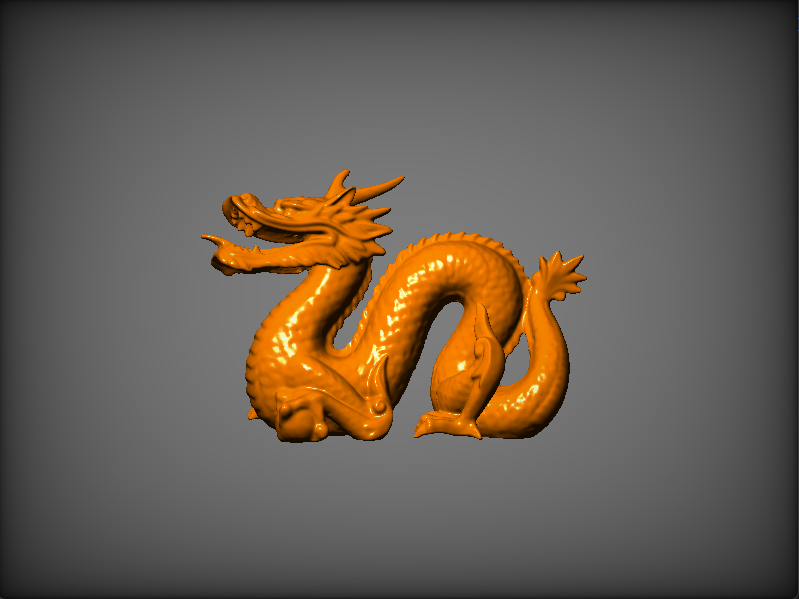

### Luminance
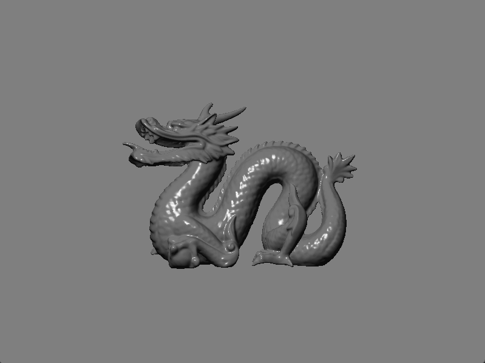

### Brightness
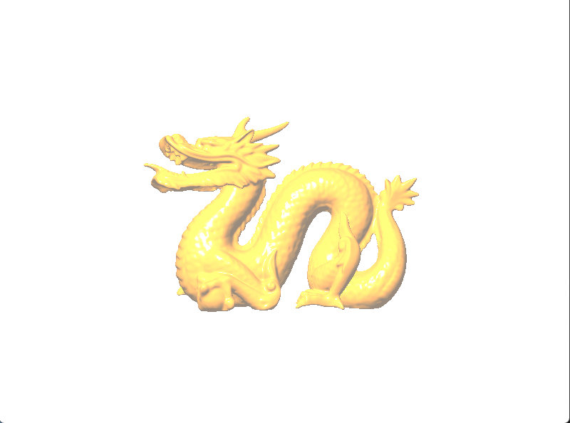

### Contrast
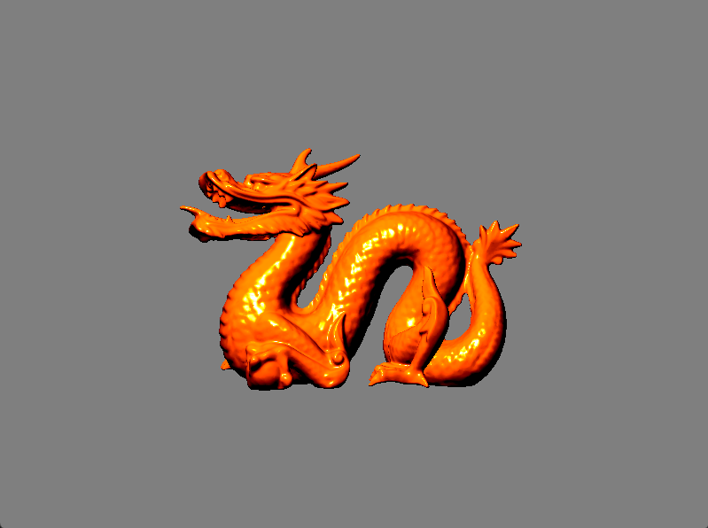

### Exposure
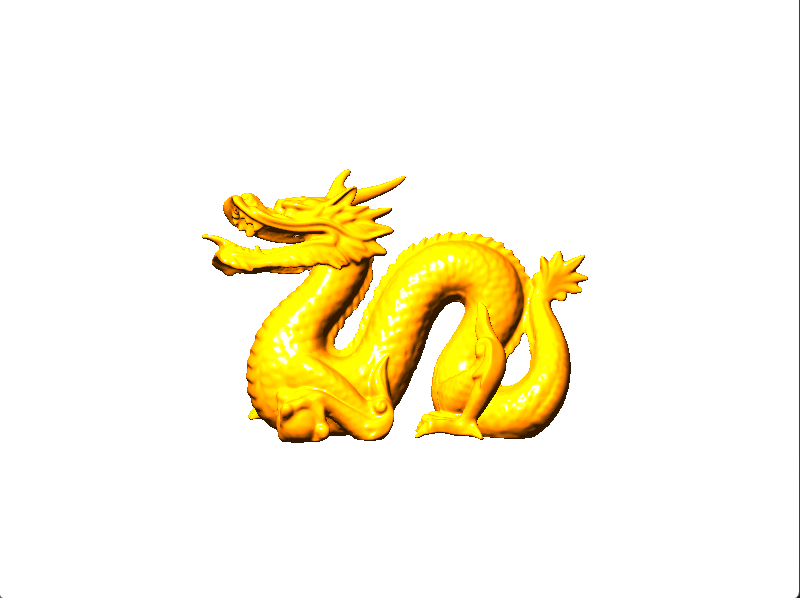

### Gamma
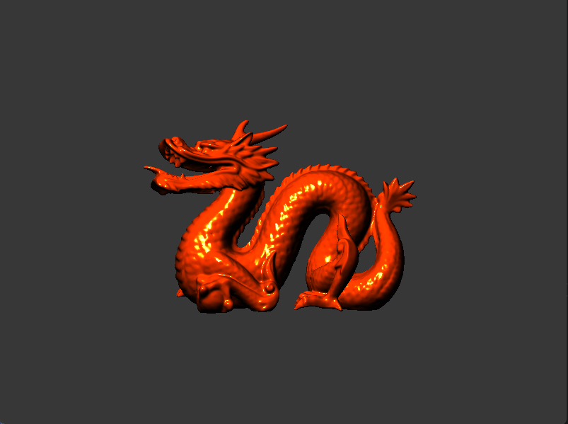

### Negative
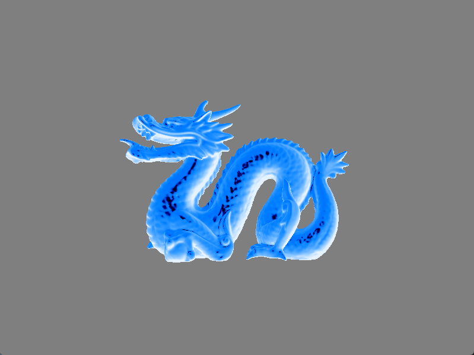

### Saturation
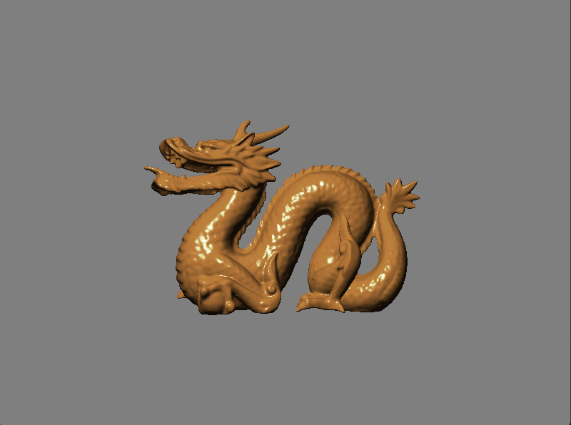

## Task 7: Particle System (20 %)-Patrick
