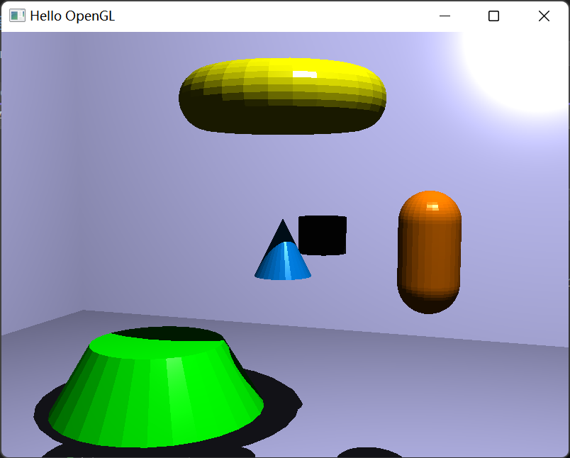

# assignment-5-final-project-team-gg
assignment-5-final-project-team-gg created by GitHub Classroom

## TASK 1: free move camera(4%)-Charles
### Key callback
```cpp
  case GLFW_KEY_UP:
      cameraPos -= cameraDirection * 0.25f;
      break;
  case GLFW_KEY_DOWN:
      cameraPos += cameraDirection * 0.25f;
      break;
  case GLFW_KEY_LEFT:
      cameraPos -= glm::normalize(glm::cross(cameraDirection, cameraUp)) * 0.25f;
      break;
  case GLFW_KEY_RIGHT:
      cameraPos += glm::normalize(glm::cross(cameraDirection, cameraUp)) * 0.25f;
      break;
```
### Mouse callback(right click to switch control(key/mouse))
```cpp
    if (button == GLFW_MOUSE_BUTTON_RIGHT && action == GLFW_PRESS) {
        mode = (mode == 0) ? 1 : 0;
    }
```

### Cursor Position
```cpp
static void cursor_position_callback(GLFWwindow* window, double xposIn, double yposIn)
{
    float xpos = static_cast<float>(xposIn);
    float ypos = static_cast<float>(yposIn);
    float xoffset = xpos - lastX;
    float yoffset = lastY - ypos; 
    float sensitivity = 0.5f; 
    glm::vec3 front;

    if (firstMouse){
        lastX = xpos;
        lastY = ypos;
        firstMouse = false;
    }

    lastX = xpos;
    lastY = ypos;

    xoffset *= sensitivity;
    yoffset *= sensitivity;

    yaw += xoffset;
    pitch += yoffset;

    if (pitch > 89.0f)
        pitch = 89.0f;
    if (pitch < -89.0f)
        pitch = -89.0f;
    float xz = cos(glm::radians(pitch));
    front.x = cos(glm::radians(yaw)) * xz;
    front.y = sin(glm::radians(pitch));
    front.z = sin(glm::radians(yaw)) * xz;
    cameraDirection = glm::normalize(front);
}
```

## TASK 2: Objects(12%)-Charles
### Object Class
```cpp
class Object{
public:
	Object(glm::vec3 coords = glm::vec3(0.0, 0.0, 0.0), glm::vec3 col = glm::vec3(1.0, 1.0, 0.0), unsigned int maxI = 0,
		bool reflecting = false, bool refracting = false, bool lighting = false,
		float ambientFactor = 0.2f, float specExponent = 50.0f) {

		this->coords = coords;
		color = col; 
		maxIndex = maxI;
		reflect = reflecting;
		refract = refracting;
		light = lighting;
		ambient = ambientFactor;
		specularEx = specExponent;
	};

	const glm::vec3& Color() { return color; };
	float AmbientFactor() { return ambient; };
	float SpecularExponent() { return specularEx; };
	bool Reflect() { return reflect; };

	void offset(glm::vec3 os) {
		coords += os;
		for (glm::vec3& i : this->vertices) {
			i += os;
		}
	}

	void adjustIndice(unsigned int os) {
		for (glm::ivec3& i : this->indices) {
			i += glm::ivec3(os, os, os);
		}
	}

	glm::vec3 coords;
	std::vector<glm::vec3> vertices;
	std::vector<glm::vec3> normals;
	std::vector<glm::ivec3> indices;
	std::vector<glm::vec2> texCoords;
	unsigned int maxIndex;
	// object color
	glm::vec3 color;
	// basic material parameters
	float ambient;
	float specularEx;
	// is this object reflecting?
	bool reflect;
	bool refract;
	bool light;

private:

};

class Plane : public Object {
public:
	float length;
	float width;
	glm::vec3 normal;
	Plane(glm::vec3 p1, glm::vec3 p2) : Object() {
		glm::vec3 p3 = -p1;
		glm::vec3 p4 = -p2;
		length = glm::distance(p1, p2);
		width = glm::distance(p2, p3);
		normal = glm::normalize(glm::cross(p1, p2));

		vertices.push_back(p1); vertices.push_back(p2); vertices.push_back(p4); vertices.push_back(p3);
		for (int i = 0; i < 4; i++) normals.push_back(normal);
		indices.push_back(glm::vec3(0, 2, 1)); indices.push_back(glm::vec3(1, 2, 3));
		maxIndex = 4;
	}
};


class Torus : public Object {
private:
public:
	float innerRadius;
	float outerRadius;
	unsigned int sector;
	unsigned int stack;
	Torus(float iR, float oR, unsigned int sec, unsigned int sta) : Object() {
		innerRadius = iR;
		outerRadius = oR;
		sector = sec;
		stack = sta;
	}
};


class Sphere : public Object {
private:
public:
	float radius;
	unsigned int sector;
	unsigned int stack;
	Sphere(float r, unsigned int sec, unsigned int sta) : Object() {
		radius = r;
		sector = sec;
		stack = sta;
	}
};

class Cylinder : public Object {
private:
public:
	float radius;
	float height;
	unsigned int sector;
	Cylinder(float r, unsigned int h, unsigned int sec) : Object() {
		radius = r;
		height = h;
		sector = sec;
	}
};

class Capsule : public Object {
private:
public:
	float radius;
	float height;
	unsigned int sector;
	unsigned int stack;
	Capsule(float r, float h, unsigned sec, unsigned sta) : Object() {
		radius = r;
		height = h;
		sector = sec;
		stack = sta;
	}
};

class Cone : public Object {
private:
public:
	float radius;
	float height;
	unsigned int sector;
	Cone(float r, float h, unsigned int sec) : Object() {
		radius = r;
		height = h;
		sector = sec;
	}
};

class TruncatedCone : public Object {
private:
public:
	float topRadius;
	float baseRadius;
	float height;
	unsigned int sector;
	TruncatedCone(float topR, float baseR, float h, unsigned int sec) {
		topRadius = topR;
		baseRadius = baseR;
		height = h;
		sector = sec;
	}
};
```
### Truncated Cone
```cpp
unsigned int truncatedCone(float topRadius, float baseRadius, int sectorCount, float height,
    std::vector<glm::vec3>& vertices, std::vector<glm::vec3>& normals,
    std::vector<glm::ivec3>& indices, std::vector<glm::vec2>& textCoords) {
    //
    float sectorStep = 2.0f * M_PI / float(sectorCount);
    float sectorAngle;
    std::vector<float> unitCircleVertices;
    glm::vec3 cylinderVertexPos;
    glm::vec2 textureCoordinate;
    float coneAngle = atanf((baseRadius - topRadius) / height);
    unsigned int maxElementIndice = 0;

    // init variables
    vertices.resize(0);
    normals.resize(0);
    indices.resize(0);
    textCoords.resize(0);

    // get unit circle vectors on XY-plane
    for (int i = 0; i <= sectorCount; ++i){
        sectorAngle = i * sectorStep;
        unitCircleVertices.push_back(sin(sectorAngle)); // x
        unitCircleVertices.push_back(0); // y
        unitCircleVertices.push_back(cos(sectorAngle));                // z
    }

    // put side vertices to arrays
    for (int i = 0; i < 2; ++i)
    {
        float h = -height / 2.0f + i * height;           // z value; -h/2 to h/2
        float t = 1.0f - i;                              // vertical tex coord; 1 to 0

        for (int j = 0, k = 0; j <= sectorCount; ++j, k += 3)
        {
            sectorAngle = j * sectorStep;

            float ux = unitCircleVertices[k];
            float uy = unitCircleVertices[k + 1];
            float uz = unitCircleVertices[k + 2];
            // position vector
            float sphereRadius = (i == 0) ? baseRadius : topRadius;
            cylinderVertexPos.x = ux * sphereRadius;
            cylinderVertexPos.y = h;
            cylinderVertexPos.z = uz * sphereRadius;
            vertices.push_back(cylinderVertexPos);

            // normal vector
            normals.push_back(glm::normalize(glm::vec3(
                cosf(coneAngle) * sinf(sectorAngle),
                sinf(coneAngle),
                cosf(coneAngle) * cosf(sectorAngle)
            )));

            // calculate texture coordinate
            textureCoordinate.x = (float)j / sectorCount;
            textureCoordinate.y = t;
            textCoords.push_back(textureCoordinate);
        }
    }

    int baseCenterIndex = (int)vertices.size();
    int topCenterIndex = baseCenterIndex + sectorCount + 1; // include center vertex

    // put base and top vertices to arrays
    for (int i = 0; i < 2; ++i)
    {
        float h = -height / 2.0f + i * height;           // z value; -h/2 to h/2
        float ny = -1 + i * 2;                           // z value of normal; -1 to 1

        // center point
        vertices.push_back(glm::vec3(0.0f, h, 0.0f));
        normals.push_back(glm::vec3(0.0f, ny, 0.0f));
        textCoords.push_back(glm::vec2(0.5f, 0.5f));

        for (int j = 0, k = 0; j < sectorCount; ++j, k += 3)
        {
            float ux = unitCircleVertices[k];
            float uz = unitCircleVertices[k + 2];
            // position vector
            float sphereRadius = (i == 0) ? baseRadius : topRadius;
            cylinderVertexPos.x = ux * sphereRadius;
            cylinderVertexPos.y = h;
            cylinderVertexPos.z = uz * sphereRadius;
            vertices.push_back(cylinderVertexPos);

            // normal vector
            normals.push_back(glm::vec3(0.0f, ny, 0.0f));

            // texture coordinate
            textureCoordinate.x = -ux * 0.5f + 0.5f;
            textureCoordinate.y = -uz * 0.5f + 0.5f;
            textCoords.push_back(textureCoordinate);

        }
    }

    unsigned int k1 = 0;                         // 1st vertex index at base
    unsigned int k2 = sectorCount + 1;           // 1st vertex index at top

    // indices for the side surface
    for (int i = 0; i < sectorCount; ++i, ++k1, ++k2)
    {
        // 2 triangles per sector
        // k1 => k1+1 => k2
        indices.push_back(glm::ivec3(k1, k2, k1 + 1));

        // k2 => k1+1 => k2+1
        indices.push_back(glm::ivec3(k1 + 1, k2, k2 + 1));
        maxElementIndice = std::max(maxElementIndice, std::max(k1, k2));
    }

    for (unsigned int i = 0, k = baseCenterIndex + 1; i < sectorCount; ++i, ++k)
    {
        if (i < sectorCount - 1)
        {
            indices.push_back(glm::ivec3(baseCenterIndex, k + 1, k));
        }
        else // last triangle
        {
            indices.push_back(glm::ivec3(baseCenterIndex, baseCenterIndex + 1, k));
        }
        maxElementIndice = std::max(maxElementIndice, k);
    }

    // indices for the top surface
    if (topRadius != 0) {
        for (unsigned int i = 0, k = topCenterIndex + 1; i < sectorCount; ++i, ++k)
        {
            if (i < sectorCount - 1)
            {
                indices.push_back(glm::ivec3(topCenterIndex, k, k + 1));
            }
            else // last triangle
            {
                indices.push_back(glm::ivec3(topCenterIndex, k, topCenterIndex + 1));
            }
            maxElementIndice = std::max(maxElementIndice, k);
        }
    }
    return maxElementIndice + 1;
}

```

### Cone
```cpp
unsigned int cone(float radius, int sectorCount, float height,
    std::vector<glm::vec3>& vertices, std::vector<glm::vec3>& normals,
    std::vector<glm::ivec3>& indices, std::vector<glm::vec2>& textCoords) {
    return truncatedCone(0.0f, radius, sectorCount, height, vertices, normals, indices, textCoords);
}
```

### Cylinder
```cpp
unsigned int cylinder(float radius, int sectorCount, float height,
    std::vector<glm::vec3>& vertices, std::vector<glm::vec3>& normals,
    std::vector<glm::ivec3>& indices, std::vector<glm::vec2>& textCoords) {
    return truncatedCone(radius, radius, sectorCount, height, vertices, normals, indices, textCoords);
}
```

### Capsule
```cpp
unsigned int capsule(float topRadius, float baseRadius, int sectorCount, int stackCount, float height,
    std::vector<glm::vec3>& vertices, std::vector<glm::vec3>& normals,
    std::vector<glm::ivec3>& indices, std::vector<glm::vec2>& textCoords) {
    //
    float xy;
    float sectorStep = 2.0f * M_PI / float(sectorCount);
    float stackStep = M_PI / float(stackCount);
    float sectorAngle, stackAngle;
    std::vector<float> unitCircleVertices;
    glm::vec3 capsuleVertexPos;
    glm::vec2 textureCoordinate;

    float cylinderHeight = height - topRadius - baseRadius;
    glm::vec3 topCenter(0.0f, cylinderHeight / 2.0f, 0.0f);
    glm::vec3 baseCenter(0.0f, -cylinderHeight / 2.0f, 0.0f);

    float coneAngle = atanf((baseRadius - topRadius) / cylinderHeight);

    // init variables
    vertices.resize(0);
    normals.resize(0);
    indices.resize(0);
    textCoords.resize(0);

    // get unit circle vectors on XZ-plane
    for (int i = 0; i <= sectorCount; ++i) {
        sectorAngle = i * sectorStep;
        unitCircleVertices.push_back(sinf(sectorAngle));                 // x
        unitCircleVertices.push_back(0);                                // y
        unitCircleVertices.push_back(cosf(sectorAngle));                 // z
    }


    // vertex, normal, texture coordinate
    for (int x = 0; x < 3; ++x) {
        switch (x) {
        case 0:     // top semisphere
            for (int i = 0; i <= (stackCount / 2); ++i) {
                stackAngle = M_PI / 2.0f - i * stackStep;
                xy = topRadius * cosf(stackAngle);
                capsuleVertexPos.y = topRadius * sinf(stackAngle) + (cylinderHeight / 2);
                for (int j = 0; j <= sectorCount; ++j) {
                    sectorAngle = j * sectorStep;

                    // vertex position
                    capsuleVertexPos.x = xy * sinf(sectorAngle);
                    capsuleVertexPos.z = xy * cosf(sectorAngle);
                    vertices.push_back(capsuleVertexPos);

                    // normalized vertex normal
                    normals.push_back(glm::normalize(capsuleVertexPos - topCenter));

                    // calculate texture coordinate
                    textureCoordinate.x = float(j) / sectorCount;
                    textureCoordinate.y = float(i) * (topRadius / height) / (stackCount/2);
                    textCoords.push_back(textureCoordinate);
                }
            }
            break;
        case 1:     // cylinder
            for (int i = 1; i >= 0; --i) {
                float h = -cylinderHeight / 2.0f + i * cylinderHeight;           // z value; h/2 to -h/2
                float t = 1.0f - i;                              // vertical tex coord; 1 to 0
                for (int j = 0, k = 0; j <= sectorCount; ++j, k += 3) {
                    sectorAngle = j * sectorStep;

                    float ux = unitCircleVertices[k];
                    float uy = unitCircleVertices[k + 1];
                    float uz = unitCircleVertices[k + 2];
                    // position vector
                    float capsuleRadius = (i == 0) ? baseRadius : topRadius;
                    capsuleVertexPos.x = ux * capsuleRadius;
                    capsuleVertexPos.y = h;
                    capsuleVertexPos.z = uz * capsuleRadius;
                    vertices.push_back(capsuleVertexPos);

                    // normal vector
                    normals.push_back(glm::normalize(glm::vec3(
                        cosf(coneAngle) * sinf(sectorAngle),
                        sinf(coneAngle),
                        cosf(coneAngle) * cosf(sectorAngle)
                    )));

                    // calculate texture coordinate
                    textureCoordinate.x = (float)j / sectorCount;
                    textureCoordinate.y = (i == 1) ? (topRadius / height) : ((height - baseRadius) / height);
                    textCoords.push_back(textureCoordinate);
                }
            }
            break;
        case 2:     // bottom semisphere
            for (int i = (stackCount / 2); i <= stackCount; ++i) {
                stackAngle = M_PI / 2.0f - i * stackStep;
                xy = baseRadius * cosf(stackAngle);
                capsuleVertexPos.y = (baseRadius * sinf(stackAngle)) - (cylinderHeight / 2);
                for (int j = 0; j <= sectorCount; ++j) {
                    sectorAngle = j * sectorStep;

                    // vertex position
                    capsuleVertexPos.x = xy * sinf(sectorAngle);
                    capsuleVertexPos.z = xy * cosf(sectorAngle);
                    vertices.push_back(capsuleVertexPos);

                    // normalized vertex normal
                    normals.push_back(glm::normalize(capsuleVertexPos - baseCenter));

                    // calculate texture coordinate
                    textureCoordinate.x = float(j) / sectorCount;
                    textureCoordinate.y = (float(i - (stackCount / 2)) * (baseRadius / height) / (stackCount / 2)) + ((height - baseRadius) / height);
                    textCoords.push_back(textureCoordinate);
                }
            }
            break;
        }
    }

    // indices
        // compute triangle indices
    unsigned int k1, k2;
    unsigned int maxElementIndice;
    for (int i = 0; i < (stackCount + 3); ++i) {
        k1 = i * (sectorCount + 1);
        k2 = k1 + sectorCount + 1;

        for (int j = 0; j < sectorCount; ++j, ++k1, ++k2) {
            // 2 triangles per sector excluding first and last stacks
            // k1 => k2 => k1+1
            if (i != 0) {
                indices.push_back(glm::ivec3(k1, k2, k1 + 1));
            }
            // k1+1 => k2 => k2+1
            if (i != (stackCount + 2)) {
                indices.push_back(glm::ivec3(k1 + 1, k2, k2 + 1));
            }
            maxElementIndice = std::max(maxElementIndice, std::max(k1, k2));
        }
    }
    return maxElementIndice + 1;
}
```

### Torus
```cpp
unsigned int torus(float outerRadius, float innerRadius, int sectorCount, int stackCount,
    std::vector<glm::vec3>& vertices, std::vector<glm::vec3>& normals,
    std::vector<glm::ivec3>& indices, std::vector<glm::vec2>& textCoords) {
    // init variables
    vertices.resize(0);
    normals.resize(0);
    indices.resize(0);
    textCoords.resize(0);
    // temp variables
    glm::vec3 torusVertexPos;
    glm::vec2 textureCoordinate;

    float sectorStep = 2.0f * M_PI / float(sectorCount);
    float stackStep = 2.0f * M_PI / float(stackCount);
    float sectorAngle, stackAngle;

    // compute vertices and normals
    for (int i = 0; i <= stackCount; ++i) {
        stackAngle = M_PI / 2.0f - i * stackStep;
        torusVertexPos.y = innerRadius * sinf(stackAngle);

        for (int j = 0; j <= sectorCount; ++j) {
            sectorAngle = j * sectorStep;

            // vertex position
            torusVertexPos.x = sinf(sectorAngle) * (innerRadius * cosf(stackAngle) + outerRadius);
            torusVertexPos.z = cosf(sectorAngle) * (innerRadius * cosf(stackAngle) + outerRadius);
            vertices.push_back(torusVertexPos);

            // normalized vertex normal
            normals.push_back(glm::normalize(torusVertexPos - glm::vec3(outerRadius * sinf(sectorAngle), 0.0f, outerRadius * cosf(sectorAngle))));

            // calculate texture coordinate
            textureCoordinate.x = float(j) / sectorCount;
            textureCoordinate.y = float(i) / stackCount;
            textCoords.push_back(textureCoordinate);
        }
    }

    // compute triangle indices
    unsigned int k1, k2;
    unsigned int maxElementIndice = 0;
    for (int i = 0; i < stackCount; ++i) {
        k1 = i * (sectorCount + 1);
        k2 = k1 + sectorCount + 1;

        for (int j = 0; j < sectorCount; ++j, ++k1, ++k2) {
            // 2 triangles per sector excluding first and last stacks
            // k1 => k2 => k1+1

            indices.push_back(glm::ivec3(k1, k2, k1 + 1));

            // k1+1 => k2 => k2+1

            indices.push_back(glm::ivec3(k1 + 1, k2, k2 + 1));

            maxElementIndice = std::max(maxElementIndice, std::max(k1, k2));

        }
    }
    return maxElementIndice + 1;

}
```

### RESULT


## TASK 3: Lights(16%)-Charles
### Light Class
```cpp
class Light {
public:
    Light(int identifier = 0, float Ia = 0.2f, float Ii = 1.0f, glm::vec3 direction = glm::vec3(0.0, 0.0, 0.0)) {
        this->identifier = identifier;
        I_a = Ia;
        I_i = Ii;
        this->direction = direction;
    }

    float I_a;
    float I_i;

    // 0: directionection, 1: Point, 2: Spot, 3: area
    float identifier;
    std::vector<glm::vec3> vertices;
    glm::vec3 direction;
};

// 1: identifier 4: vertex 1: directionection 1:Ia 1:Ii

class directionectionalLight : public Light {
public:
    directionectionalLight(glm::vec3 d) : Light() {
        identifier = 0;
        for (int i = 0; i < 4; i++) vertices.push_back(glm::vec3(0, 0, 0));
        direction = d;
    }
};


class PointLight : public Light {
public:
    glm::vec3 position;
    PointLight(glm::vec3 p) : Light() {
        identifier = 1;

        position = p;
        vertices.push_back(position);
        for (int i = 0; i < 3; i++) vertices.push_back(glm::vec3(0, 0, 0));

    }
};


class SpotLight : public Light {
public:
    SpotLight(glm::vec3 p, glm::vec3 d, float a) : Light() {
        identifier = 2;

        vertices.push_back(p);
        vertices.push_back(glm::vec3(a, 0.0, 0.0));
        for (int i = 0; i < 2; i++) vertices.push_back(glm::vec3(0, 0, 0));

        direction = d;

    }
};


class Arealight : public Light {
public:
    Arealight(glm::vec3 v1, glm::vec3 v2, glm::vec3 center) : Light() {
        identifier = 3;

        glm::vec3 v3, v4;
        v3 = center + (center - v1);
        v4 = center + (center - v2);
        vertices.push_back(v1);
        vertices.push_back(v2);
        vertices.push_back(v3);
        vertices.push_back(v4);

        direction = glm::normalize( glm::cross((v1 - center), (v2 - center)) );

    }

};
```
### pass data to tbo
```cpp
void TBOlight_prepare(std::vector<float>& tbo, int id, 
    std::vector<glm::vec3>& vertex,
    glm::vec3 direction,
    float Ia, float Ii) {

    //std::cout << Ia << Ii << std::endl;
    tbo.push_back((float)id);
    tbo.push_back(Ia);
    tbo.push_back(Ii);
    for (int i = 0; i < 4; ++i) {
        // positions
        tbo.push_back(vertex[i].x);
        tbo.push_back(vertex[i].y);
        tbo.push_back(vertex[i].z);
    }

    tbo.push_back(direction.x);
    tbo.push_back(direction.y);
    tbo.push_back(direction.z);
}
```

### get data in fragement shader
```cpp
struct Light{
    float id;
    float Ia;
    float Ii;
    vec3 p1;
    vec3 p2;
    vec3 p3;
    vec3 p4;
    vec3 dir;
};

Light get_light(int i){
// [id Ia Ii] [p1] [p2] [p3] [p4] [dir]
    Light light;
    light.id = texelFetch(tria2, 6 * i).r;
    light.Ia = texelFetch(tria2, 6 * i).g;
    light.Ii = texelFetch(tria2, 6 * i).b;
    light.p1 = texelFetch(tria2, 6 * i + 1).rgb;
    light.p2 = texelFetch(tria2, 6 * i + 2).rgb;
    light.p3 = texelFetch(tria2, 6 * i + 3).rgb;
    light.p4 = texelFetch(tria2, 6 * i + 4).rgb;
    light.dir = texelFetch(tria2, 6 * i + 5).rgb;
    return light;
}
```
### Directional light

### Point light

### Spot light

### Area light


## TASK 4: Ray Tracing(16%)-Nick


## TASK 5: Spatial Data Structure(20%)-Nick


## TASK 6: Screen-space Methods (12 %)-Patrick


## Task 7: Particle System (20 %)-Patrick
